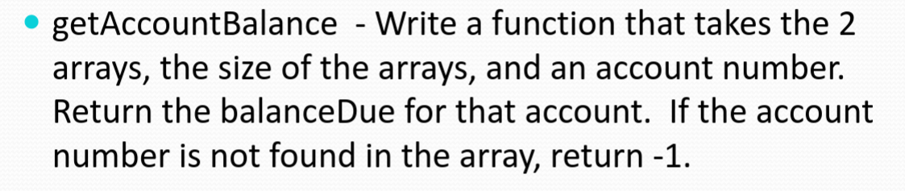

# Data types, variables, operations, input/output

The `main()` function is the entry point of our program, and the `stdio.h` header is imported for basic commands. For now, code will look like this:

```c
#include <stdio.h>

void main()
{
...
}
```

## Data types and variables

Variables are named locations in memory with a data type. The data types in C are as follows:


“Unsigned” means that the variable cannot be negative, and “range” means the set of values a variable of a given data type can hold before information becomes unreliable. The `sizeof()` function can be used to determine how much storage a variable is taking up.

The order of magnitude for these data types (from smallest to largest) is:

1. Smallest whole number: char (1 byte)
2. 2nd smallest whole number: short (2 bytes)
3. 2nd largest whole number: int (4 bytes)
4. Largest whole number: long long (8 bytes)
5. Smallest decimal number: float (4 bytes)
6. Largest decimal number: double (8 bytes)

The data types that we will discuss are `int` (integer numbers), `double` (decimal numbers), and `char` (ASCII characters/strings).

The `char` data type still technically holds a number, but the compiler uses the built in ASCII table to translate numbers to text. Each number from 0 - 127 has its own corresponding character. One fact to note is that the number corresponding to a given uppercase letter is 32 less than the number corresponding to its lowercase counterpart, which can be useful for making letters uppercase or lowercase in code.


When we initialize a variable (assign it a value), it is considered good practice to initialize it to 0 rather than not giving it a value even if we’re going to change its value later and the initial value is insignificant. This is because leaving it “empty” is not truly leaving it empty, and gives it a random value that may mess up your code.

We can perform arithmetic operations with numbers and variables in C. The order of operations still applies, so parantheses in complex operations are considered good practice. The modulo operator `%` returns the remainder of a division, which is useful for things like determining if a given number is even or odd (an even number divided by 2 results in a remainder of 0, an even number doesn’t).

## Division and typecasting

Division can cause complexities. Arithmetic operators, including `/`, have a type; when dividing two `int`s it performs integer division and when dividing two `double`s it performs double division. 10 / 3 is an example of integer division, and results in 3 because it truncates the fraction part. 10.0 / 3.0 is an example of double division, and results in 3.333…What happens if we are dividing an `int` and a `double`? The `int` is then promoted to a `double`, resulting in double division.

How about if we assign division to a variable? For example,

```c
int doubleDivision = 10.0 / 3.0;
```

This operation results in double division; however, because an `int` must hold an integer, the double is demoted to an integer when it is assigned, going from 3.333… to 3. The opposite happens here:

```c
double intDivision = 10 / 3;
```

Integer division is performed, but since a `double` must hold a double, 3 is promoted to 3.0.

Typecasting is a way to temporarily and explicitly change the data type of a value. It’s useful for two reasons: acknowledging demotion may occur in an operation so that other programmers understand you know what you’re doing (downcasting):

```c
//"Yes, I know this will result in 3, not 3.333!"
//(10.0 / 3.0) evaluates to 3.0, and (int) makes it 3
int intDivision = (int) (10.0 / 3.0);
```

… or to prevent data loss and ensure an accurate result (upcasting):

```c
//"Don't let the answer be 3, it should be 3.333."
//Forces 10 to become a double, which then promotes 3 to a double
//and results in 3.0
double doubleDivision = (double) 10 / 3;
```

Be careful of parantheses and order of operations; if you do `(double) (10 / 3)` then
`(10 / 3)` will result in `3` due to integer division, and all `(double)` does is turn the `3` to a `3.0`.

## printf and scanf

To output information to the terminal, the `printf()` function is used. To have the user input information, print the prompt with `printf()` and use `scanf()` to store the input in a variable.

```c
#include <stdio.h>

void main()
{
    int num = 5;
    printf("num is %i\n", num);
    
    int favoriteNum = 0;
    printf("Input your favorite number: ");
    scanf("%i", &favoriteNum);
}
```

`\n` is an escape character which tells the program for the next output to be printed on the next line. Another escape character is `\t` for tab. `%` sequences are needed for both functions, which specify where in the string to output data for `printf()` and how to interpret the data type for `scanf()`. `%i` or `%d` for `int` values,`%lf` for double values, and `%c` for `char` values (letters for now). `scanf()` in this code tells the program to store the user input as an `int` in `favoriteNum`. Text between the `%` and the character(s) specify justification and width. In `%-x.ylf`, the `-` indicates left justification, `x` specifies the amount of spaces (width) and `y` specifies the amount of decimal places (accuracy) `%.2lf` means print 2 decimal places past the decimal (3.33 rather than 3.3333).

# Selection, relational and logical operators, repetition, random numbers

## Selection and relational operators

So far, the code we’ve looked at is pretty straightforward. Selection, also called “branching”, refers to choosing one of multiple “paths” in the code based on pre-set conditions. These conditions are set with relational operators, which are:

- `>` greater than, `<` less than
- `>=` greater than or equal to, `<=` less than or equal to
- `==` equal to, `!=` is not equal to

Each relational operation between two values using these operators evaluates to either TRUE or FALSE. Some programming languages have a Boolean data type for TRUE and FALSE, but in C FALSE is 0 and TRUE is any number ≠ 0.

## If statements

If statements (a selection construct) use relational operations to execute (or not to execute) code.

```c
int a = 5;
int b = 6;
if (b > a)
		printf("Hello world!");
```

In the above code “Hello world!” is printed, because `b` is in fact greater than `a`. If `b` was not greater than `a`, then nothing would have happened. But what if we want something to happen in that case? That’s the point of an if-else statement:

```c
if (b > a)
		printf("Hello world!");
else
		printf("b was not greater than a");
```

However, `else` is saying “in any other case, execute this code.” What if we have another condition to try before that? We can use an else-if statement, where you can have as many if-else statements in a row (before ending it, if you’d like):

```c
if (b > a)
	printf("b was greater than a");
else if (b == a)
	printf("b and a were the same value");
else if (b < a)
	printf("a was greater than b");
else
	printf("I don't know the relation between a and b!");
```

## Switch statements

Switch statements are selection constructs that are only used in very specific scenarios. If we had the user input an integer number and wanted to check what it was, we could use a series of if statements:

```c
int userInput = 0;
printf("Input a number: ");
scanf("%i", &userInput);
if (userInput == 1)
		printf("userInput is 1!");
else if (userInput == 2)
		printf("userInput is 2!");
```

and so on. But with a switch statement, we can just do this:

```c
int userInput = 0;
printf("Input a number: ");
scanf("%i", &userInput);
switch(userInput)
{
		case 1:
		    printf("userInput is 1!");
    case 2:
		    printf("userInput is 2!");
}
```

As a note: if statements with one line of code to execute don’t require curly brackets, but multiple lines do:

```c
if (1 > 0)
{
	printf("1 is greater than 0.\n")
	printf("The above statement is true.\n")
} else printf("1 is not greater than 0.");
```

## Ternary operators

Ternary operators allow for short hand writing of an if else statement. Not advised for most situations and is difficult to read, but you should be aware of it:
```c
int x = (y == 5) ? 0 : 1;
//is equivalent to
if (y == 5)
		x = 0;
else
		x = 1;
```

## Logical operators and operations

So far, we can only use one relational operator, like `x < 10`. How about compounding relational operators, like if we wanted to check whether `x` was less than 10 but also more than 5? This is where logical operators come in.

- `!` unary/not, `&` AND, `||` OR

These can be used to combine a bunch of conditions. If you wanted to check whether `x` was between 5 and 10:

```c
if (x > 5 && x < 10) ...
```

Both evaluate to TRUE, so the expression evaluates to TRUE. How about when it becomes more complex, like

```c
int a 10, b = 6, c = 1, d = 0;
if (a > b || c == d && a < d) ...
```

Where do we start? There is an order of operations they have to follow, which is demonstrated here:


Essentially, because the final evaluation came down to a TRUE expression OR a FALSE one, the TRUE expression was selected.

It’s easy to get confused here:

```c
int a = 10, b = 6;
if (!a < b) ...
```

What does `(!a < b)` evaluate to? Does it say “if `b` is not greater than `a`" as expected? No!

`!` is executed first, so `!a` (`!10`) evaluates to FALSE (which is `0`), meaning our expression is now `(0 < 6)`; which evaluates to TRUE. This is why parantheses are necessary; the correct expression would be written as

```c
if (!(a < b))
```

to ensure that `(a < b)` (FALSE) gets evaluated first, then `(!(FALSE))` (not FALSE) results in TRUE; `b` is not greater than `a`.

*Challenge*

With this information, let’s write this program:

> Create a commission calculator for a sales representative.
> 
> 
> For this calculator a simple commission is provided based on the number of sales a person makes.
> 
> - If they made $5,000 or less in sales they receive a 5% commission (0.05)
> - If they made more than $5,000, but less than or equal to $10,000, they receive a 7.5% commission (0.075)
> - If they made more than $10,000 they receive a 9% commission (0.09)
> 
> Design:
> 
> - Prompt the user to enter their sales total as a whole number
>     - We are not going to worry about fractions for their input
> - Using if statements, calculate their commission given the table above
>     - This should be a series of if, else if and else statements
> - Output the commission to the screen

```c
#include <stdio.h>

void main()
{
		int sales=0;
		float commission=0.0;
		printf("Enter the sales amount: ");
		scanf("%i", &sales);

		if (sales <= 5000)
			commission = sales * 0.05;
		else if (sales > 5000 && sales <= 10000)
			commission = sales * 0.075;
		else
			commission = sales * 0.09;
		printf("Your commission is: $%.2lf", commission);
}
```

# Repetition

The flow of code in C is described in terms of 3 basic control structures. So far, we have learned sequential (code continues from top to bottom) and selection (program selects code to be executed based on relational and logical operators). Now, we’ll cover repetition: the repetition of code until a relational expression is FALSE.

Before we learn about repetition and loops, we must first learn about compound assignment and incrementing/decrementing shortcuts.

Compound assignments are shortcuts we can use for arithmetic operators. With our knowledge, if we already had a value and wanted to add 2 to it, we would write `value = value + 2`. However, the compound assignment `value += 2` does the same thing! We can do the same for subtraction (`-=`), too. This is useful for *accumulator variables*, which intend to gather information in a loop.

Incrementing/decrementing shortcuts refers to adding 1 to or subtracting 1 from a variable. We would write this as `variable++;` for incrementing and `variable--;` for decrementing. This is useful for *counter variables*, which decide how many times a loop runs, or iterates.

There are two types of loops: counter controlled loops and sentinel controlled loops. Counter controlled loops are - you guessed it - controlled by counter variables; the counter variable increments by 1 each iteration until it reaches a predetermined value, ending the loop. Sentinel controlled loops are controlled by a sentinel value; once a certain variable is equal to this sentinel value, the loop ends. Usually, this is used to have a user end a loop by inputting that value to signify they are done.

## While loops

Let’s start with a while loop.

```c
int a = 0;
while (a < 10)
		printf("%i\n", a);
		a++;
```

This code reads, “let `a` be 0. So long as `a` is less than 10, print the value of `a`, then add 1 to `a`.” This means that the second the relational expression `a < 10` is FALSE (i.e. once `a == 10`), the code in the while statement no longer executes, and `a` remains 10. `a` here is the counter variable, since it’s determining when the loop ends and only increments by 1; so this is a counter controlled loop. For it to be a sentinel controlled loop, it would be `while (a != 10)`.

Essentially, loops exist to make programming more efficient; you could have technically written `a++;` 10 times, but this would be a waste of time and is a pain to read.

What would be the use of an accumulator variable here? What if we wanted to find the sum of all values that `a` has been equal to, from 0 to 9? Let’s use `b` as our accumulator:

```c
int a, b = 0;
while (a < 10)
		a++;
		b += a;
```

At the end, `b` should be equal to 0+1+2+3+4+5+6+7+8+9, which is 45. The code reads, “let `a` and `b` be 0. As long as `a` is less than 10, increment `a` by 1 and add the current value of `a` to `b`.”

## Do-while loops

Do-while loops are another type of loop.

```c
do
{
	...
} while (relational expression)
```

Do-whiles are post test loops, meaning the code executes before the relational expression is tested. Whiles are pre test loops since they test the relational expression before execution. Because of this quality, do-whiles are rarely used.

## For loops

Now for for loops, one of the most commonly used loops across programming languages:

```c
for (int i = 0; i < 10; i++)
{
		printf("%i\n", i);
}
```

Compare this with the first while loop we made earlier; they have all the same elements, just placed a little differently!

```c
int a = 0;
while (a < 10)
		printf("%i\n", a);
		a;
```

However, the for loop seems a lot cleaner. Because for loops are designed for running a specific amount of times (counter controlled loop) and their condition should be `i < num`, `i > num` or `i == num`, for loops are commonly used for counter controlled loops and while loops, though they can be used for counter controlled loops (as we’ve done) are instead commonly used for sentinel controlled loops, like so:

```c
num userInput = 0;
while (userInput != -1)
{
		printf("Input any integer to keep the program running. Input a -1 to stop it: ");
		scanf("%i", userInput);
}
```

The user will keep being prompted for a number. Once they input `-1`, the loop will stop.

The reason why this convention is in place is so when you’re working on a project and see a for loop, you automatically know it’s counter controlled and when you see a while loop, you automatically know it’s sentinel controlled.

`#define` is useful for working with loops, as well as future concepts like arrays. It’s a preprocessor command similar to `#include` that lets you substitute a phrase for a number. Let’s say you wanted to iterate through every day of the week:

```c
#include <stdio.h>
#define NUMBER_OF_DAYS_IN_WEEK 7

int i;
for (int i = 0; i < NUMBER_OF_DAYS_IN_WEEK; i++)
{
	...
}
```

This makes it easier for you as well as others to understand your code.

*Challenge*

With this information, let’s write this program:

> Ask the user to input a number. Determine the numbers of factors of that number.
> 
> - Input 12 / output 1 2 3 4 6 12
> - Input 5 / output 1 5

I’ll walk you through this one.

The core of the logic behind this program is obvious: how do you determine what the factors of a given number are? The simplest way to implement this in a program is to have a for loop starting at `i = 1`, where `i` is the potential factor, and having the loop end after `i` is larger than the given number, since a factor of a number can’t be bigger than the number itself. We perform `num % i`, which divides the number by the potential factor and stores it in `factorCheck`; if it’s 0, we know `i` is a factor and print it, the loop adds 1 to `i`, and it continues. 

```c
#include <stdio.h>
void main()
{
	int num = 0;
	printf("Enter a number: ");
	scanf("%i", &num);
	for (int i = 1; i <= num; i++)
	{
		 int factorCheck = num % i;
		 if (factorCheck == 0)
        {
           int factor = i;
           printf("%i ", factor);
        }
	}
}
```

## Random numbers

C uses an algorithm that takes a starting number (seed) and generates a set of random numbers to be called. A particularly seed will always generate the same set of random numbers, and hence this process is psuedo-random. Often, the current time is used as the seed. C, like other languages, uses the Unix timestamp, the amount of seconds elapsed since 1 Jan 1970.

The syntax for the seed function is `srand(starting number)`, given `<stdlib.h>` is included. `time(NULL)` returns the current time, given `<time.h>` is included. Thus to use the current time as the seed, you would write `srand(time(NULL))`. `rand()` gets the next number in the random set, and ranges between 0 and 6500. You can constrain its range thus:

`rand() % 6`: random value from 1-5, `rand() % 7`: random value from 1-6, etc. This is because the remainder of a division is always less than the number being divided by; if we divide any number by 6, the remainder has to be from 1-5.

*Challenge*

> Generate a random number from 1-6.
> 
> - Repeat this 1000 times.
> - Count how many times a 1 is seen.
> - Output a percentage of how many times a 1 is seen.

First, import all the relevant libraries. We’ll start with the seeding function and a variable to count how many ones there are, `oneChecker`. We’ll use a counter controlled loop and hence a for loop, running so long as `i <= 1000.` The output of `rand() % 7` has to be stored in a variable in order to be checked.

```c
#include <stdio.h>
#include <stdlib.h>
#include <time.h>

void main()
{
    srand(time(NULL));
    double oneChecker = 0;
    for (int i = 0; i <= 1000; i++)
    {
        int randNum = rand() % 7;
        if (randNum == 1)
        {
            oneChecker++;
        }
    }
    double onePercentage = (oneChecker/1000) * 100;
    printf("%.1lf%%", onePercentage);
}
```

Last in selection in repetition is continuing and breaking.

```c
//hit something problematic and want to get out of the loop
for (int i = 0; i < 0; i++)
{
	if (i == 7)
		break;
	printf("%d\n", i);
}

//useful for processing large amounts of data, if you run into some data
//you're not sure what to do with, but you don't want to give up
//on all the other pieces of data, so you just skip the odd pieces
//for example if going through names and there's an empty slot, skip empty slot
for (int i = 0; i < 0; i++)
{
	if (i % 2 == 0)
		continue;
	printf("%d\n", i);
}
```

# Arrays, functions

## Arrays

Arrays are variables that hold multiple values of the same data type. The size of the array needs to be defined at declaration.

```c
int integerArray[5];
```

This declares an array of 5 integers, which are automatically initialized to 0. Arrays are zero-indexed; creating an array with size 5 means its valid indexes would be 0, 1, 2, 3, and 4. Hence, the last valid index to access an element of an array is size - 1. If we wanted to initialize those values to something other than 0, we could do it like this:

```c
integerArray[0] = 5;
integerArray[1] = 7;
integerArray[2] = 3;
integerArray[3] = 5;
integerArray[4] = 2;
```

or we could initialize the array instead:

```c
int integerArray[5] = {5, 7, 3, 5, 2};
```

You can also set a variable to an element in an array:

```c
int firstIndex;
firstIndex = integerArray[0];
```

If you initialize a few elements of an array without initializing the rest, the rest will still be 0. You can also use arithmetic to define elements:

```c
int array[2] = {1};

int array[1] = array[0] + 1; //array[1] is 1 + 1 = 2
```

Often you use `#define` to substitute a label for the array size; if you need to update its size when you have multiple instances of it in the code, you can simply change the definition.

Often you use repetition to go through an array. This program prints each element of the array.

```c
#define GRADE_COUNT 10
int grades[GRADE_COUNT] = {0};
for (int i = 0; i < GRADE_COUNT; i++)
{
	printf("%d\n", grades[i]);
}
```

We can also make multidimensional arrays, like 2D arrays.


They can be initialized like so in code:

```c
int twoDimensionalArray[3][4] =
{
		{1, 2, 3, 4};
		{1, 2, 3, 4};
		{1, 2, 3, 4};
}
```

*Challenge*

> Ask the user to enter 5 rainfall values (doubles).
Store them in an array.
Output the total and average rainfall.
> 

```c
#define RAINFALL_SIZE 5
#include <stdio.h>

void main()
{
	double rainfall[RAINFALL_SIZE];
	//We start with the first element. As long as the element is less than 5, run.
	for (int i = 0; i < RAINFALL_SIZE; i++)
	{
		printf("Enter your rainfall value (%i/%i): ", i + 1, RAINFALL_SIZE);
		scanf("%lf", &rainfall[i]);	
    }
	double total = rainfall[0] + rainfall[1] + rainfall[2] + rainfall[3] + rainfall[4];
	double average = (total/RAINFALL_SIZE);
	printf("The total rainfall was %.2lf.\n", total);
	printf("The average rainfall was %.2lf.\n", average);
}
```

Strings are arrays of characters. They use double quotes `""` rather than single quotes `''`. They are used in functions like `printf`.

Strings are slightly different than arrays, as they can be initialized with `""` and their size needs to be the amount of letters + 1. This is because a special character `\0` is used at the end of every string (and for all non-initialized indexes) to signal its end.

Use `%s` to print a string with `printf`. `scanf` isn’t good at taking in strings, so we use `gets(stringname)` instead. Often, with both arrays and strings, a size larger than the amount of initialized indexes or characters is used so that more values can be indexed later.

This program stores "Hello world!" then the user's name in the same variable.

```c
char testString[30] = "Hello world!\n";
printf("%s", testString);
printf("Now enter your name: ");
gets(testString);
printf("Hello %s\n");
```

*Challenge*

> Four students have taken four quizzes.
> Create a 4x4 table. The first index is students, the second is the quiz.
> Calculate and output the average grade for each quiz.
> Calculate and output the average grade each student has.

```c
#define STUDENT_SIZE 4
#define QUIZ_SIZE 4
#include <stdio.h>

void main()
{
	/*
        Students Grades
        1        97, 94, 95, 98
        2        84, 83, 81, 79
        3        23, 85, 21, 34
        4        91, 31, 34, 81
    */
	int quizGrades[STUDENT_SIZE][QUIZ_SIZE] = {
                                                {97, 94, 95, 98},
                                                {84, 83, 81, 79},
                                                {23, 85, 21, 34},
                                                {91, 31, 34, 81}
                                              };
    printf("Students Grades");
	/*
        We want to print the student's number, then their grades, then move to the next line and next student.
        We'll use the outer for loop 'student' to determine which line/student we're on
        And the inner for loop 'grade' to determine what grade we're currently printing
        We'll use i to count which line/student we're on and variable 'next' to count what we need to print next
        i.e. print student's number if next is 0, and continue to print grades until next is 5
        Each print will be an increment to next and each completion of a line will be an increment to i
        So once i reaches 5 it's reset to 0 and the next line is printed.
    */
    int student = 0;
    int grade = 0;
    for (student = 0; student < STUDENT_SIZE; student++)
    {
        //New line and print student number
        printf("\n%-9i", student + 1);
        for (grade = 0; grade < QUIZ_SIZE; grade++)
        {
            printf("%i", quizGrades[student][grade]);
            /*
                Adding commas and spaces for first three grades of each line
                Was going to use for or while loop, but since we're already in a for loop if works fine.
            */
            if (grade < 3) printf(", ");
        }
    }
}
```

*Challenge*

> Ask the user to input their first name into a string of size 30.
> Go through the string and make sure every letter is capitalized.
> Output their capitalized name.

Note: The reason why the statement `name[i] = name[i] + ('A' - 'a');` capitalizes the letter is because a capital and lowercase letter are always 32 characters away from each other on the ASCII correspondence table. Therefore if you subtract 32 from the current lowercase character and assign that value to the character, it will become uppercase.

```c
#include <stdio.h>

void main()
{
    char name[30];
    printf("Enter your name: ");
    gets(name);

    for (int i = 0; name[i] != '\0'; i++)
    {
		//if the current letter is lowercase
        if (name[i] >= 'a' && name[i] <= 'z') 
        {
            name[i] = name[i] + ('A' - 'a');
        }
    }
    printf("%s", name);
}
```

*Challenge*

> 
> 
> 1. Create a string of 100 characters in size.
> 2. Create counter variables to count the total number of spaces and total number of characters. Initialize them to 0.
> 3. Prompt the user to enter a string and read it in using the gets function.
> 4. Create a loop to go from index 0 to the point that a '\0' character is seen.
>     - If the character is a space output which index you are at.
>     - If the character is space add one to the total spaces.
>     - Add one to the total number of characters so long as the character is not '\0'.
> 5. Output the total number of spaces and total number of characters.

```c
#include <stdio.h>

void main()
{
	char string[100];
	int numCharacters = 0;
	int numSpaces = 0;
	printf("Enter a string: ");
	gets(string);
	//ends at end of string instead of going through all 100 characters
	for (int i = 0; string[i] != '\0'; i++)
	{
		numCharacters++;
		if (string[i] == ' ')
		{
			numSpaces++;
			printf("Space at index %i\n\n", i);
		}
	}
	printf("Total spaces: %i\n", numSpaces);
	printf("Total characters: %i", numCharacters);
}
```

Since programs can become very complex very quickly, the best approach is to divide the program into smaller programs called “modules”. In C, functional modules are called functions. So far we have defined one function, `main()`.

Breaking up pieces of our program into modules makes the code easier to read, easier to maintain, and easier to re-use.

In the right program, the problem has been “abstracted” at the main function. This means that higher levels in the hierarchy are simple, contain less detail and are more vague, only calling other functions - and details are left to individual, “lower” modules/functions. This makes the modules easier to work and re-use.


Functions are aimed at only solving a single problem and thus should be short, no longer than a page. They should not be defined within other functions.

So instead of doing

```c
void main()
{
		//a bunch of logic
}
```

you should do

```c
void main()
{
		function1(parameter);
		function2();
		function3(parameter1, parameter2);
}
```

and only put necessary information in `main()`.

The declaration of a function should end with a `;`, while its definition should contain `{}`. Declaring a function lays out its structure (data type, name, parameters), whereas defining it details its process.

```c
//declaring
void function();

//defining
void function()
{
		//logic
}
```

It should be a habit to declare functions at the beginning of the program, then define them after the main function. Professionally, declarations of all functions are placed in a header file, then imported at the top of the program. This is beneficial because just by looking at all the function declarations, one can get an idea of what the program is doing without dealing of all the details of the function processes.

Another benefit of declaring all functions at the top rather than defining them is, if programming with a top-bottom approach, it is easier to visualize the functions being called, then being declared in order.

The word at the beginning of the function (**`void** main`) refers to the data type that the function returns, if any. If no data is returned, the data type of the function should be void. 

Functions can have no parameters or several. Each parameter consists of a data type and a *local* variable name (`int x`). This means that regardless of the name of the variable being passed to the function, the name in the parameter is only recognized inside the function. These are copies of the variables being passed in and do not affect the originals.

```c
void main()
{
	x = 5
	y = 2
	function(x, y);
}

int function (int x, int y)
{
	x+=1;
	y-=1;
}
```

Think of `x` and `y` in the context of the function as clones of the original variables in `main()`. `function()` makes its “clone” of `x` go from 5 to 6 and `y` from 2 to 1, but the original x and y remain equal to 5 and 2. `function()`’s `x` and `y` could also be called `a` and `b`.

Functions can also be called with constant numbers: `myFunction(10, 3, a, b);`.

The C keyword `return` is used to complete the function and return a value. This doesn’t necessarily have to be on the last line:

```c
if (x == y)
	return 1;
else
{
	x = y + 1;
	return 0;
}
```

If `x == y`, 1 is returned and the function quits; if not, `x` gets `y + 1`, a 0 is returned, and the function quits.

To store the value that is returned, we must store it in a variable and call it at the same time:

```c
int addition(int x, int y);

void main()
{
		int x, y = 5;
		result = add(x, y); //result is 10
}

int addition(int x, int y)
{
		return x + y;
}
```

1. Looked up the `addition` function and found its definition
2. Saved the state of the `main` function, paused the program, and began executing the `add` function
3. Copied the values from `x` and `y` into the function’s local variables `x` and `y`
4. The function calculated `x+y` and returned its value. After exiting the function, the local variables were destroyed/released, freeing the memory.
5. Set the value returned from function to `result`.

You can pass an array as a parameter to a function; the size needs to be passed separately.

```c
void processArray(array[], 3);

void main()
{
		int array[] = {1, 2, 3};
		processArray(array);
}
```

*Challenge*

> Define a function that takes 3 int parameters and returns the largest of those values.
> 

```c
#include <stdio.h>

int largest();

void main()
{
	int x, y, z = 0;
	int largestNum = 0;
	printf("Enter three numbers: ");
	scanf("%i %i %i", &x, &y, &z);
	largestNum = largest(x, y, z);
	printf("%i", largestNum);
}

int largest(int x, int y, int z)
{
	if (x > y && x > z)
		return x;
	else if (y > x && y > z)
		return y;
	/*
	Could also do else return z, C thinks there's a way to get through this code
	without returning anything because of that
	*/
	if (z > x && z > y)
		return z;
}
```

# Recursion, scope, global variables

## Recursion

Recursion is where a function calls itself within its definition. It’s very powerful for problem solving, but very dangerous if not designed well; if there’s no exit condition or if the function is called too many times, memory can quickly run out and you run into a stack overflow.

```c
int sum(int k);

int main()
{
  int result = sum(10);
  printf("%d", result);
  return 0;
}

int sum(int k)
{
  if (k > 0)
    return k + sum(k - 1);
  else return 0;
}
```

Since 10 > 0, the returned value is 10 + `sum(9)`; so we have to evaluate `sum(9)` to evaluate `sum(10)`. However, `sum(9)` is also dependent upon `sum(8)`, since `sum(9)` returns `9 + sum(8)`. This means that the value of `result`, which is `sum(10)`, as well as the values it depends on, all depend on one final call, which is `sum(0)`. This returns 0, which allows us to evaluate the previous call, `sum(1)`, which consists of `1 + sum(0)`. We now know that `sum(0)` is 0, and therefore `sum(1)` returns 1. Now we can evaluate `sum(2)`, `2 + sum(1)`, which is 3. When we get to the top and evaluate `sum(10)`, we get 55; the sum of every number up until 10. Essentially, this function adds each number including and less than a certain value to the number less than it; `sum(n)` really just returns `n` unless `n` is 0, from which the function builds itself back up with that “brute fact”.

A more efficient way to do this without recursion would be:

```c
//"direct calculation" method (1+2+3+4+5+6+7+8+9+10)
int sum(int k)
{
	int sumProducts[k];
    int totalSum = 0;
    //will run 10 times
    for (int i = 0; i < k; i++)
    {
        //putting every number 0 < n <= 10 in an array:
        //[0] is 1, [1] is 2, etc
        sumProducts[i] = i + 1;
        totalSum = totalSum + sumProducts[i];
    }
	return totalSum;
}

//"heap sum" method (10+9=19, 19+8=27, 27+7..)

int sum(int k)
{
    int sum = 0;
    for (int i = k; i > 1; i--)
    {
        if (i == k) sum = i + (i - 1);
        else sum = sum + (i - 1);
        printf("%i\n", sum);
    }
    return sum;
}
```

Recursive functions are not ideal and algorithm engineers try to find ways to not use them, since the saving of the state and beginning a new program (function call) takes up a ton of memory and can lead to a stack overflow error

*Challenge*

> Ask the user to enter 5 daily rainfall amounts in doubles. Only allow positive rainfall amounts.  When the user enters a negative number, tell them that the number is not valid, and they should enter another value.  Calculate the total rainfall and the average rainfall. Determine the largest daily rainfall, and the smallest daily rainfall.  Output the total, average, largest and smallest using informative messages.
> 

```c
#define RAINFALL_SIZE 5
#include <stdio.h>

double totalRainfall(double values[], int size);
double averageRainfall(double total);
void outputCalculations(double total, double average);

void main()
{
    double values[RAINFALL_SIZE];
    for (int i = 0; i < RAINFALL_SIZE; i++)
    {
        printf("Enter your rainfall value (%i/%i): ", i + 1, RAINFALL_SIZE);
        scanf("%lf", &values[i]);
        if (values[i] < 0)
        {
            values[i] = 0;
            printf("Invalid number! ");
        }
    }
    double total = totalRainfall(values, RAINFALL_SIZE);
    double average = averageRainfall(total);
    outputCalculations(total, average);
}

double totalRainfall(double values[], int size)
{
    double sum = 0;
    for (int i = 0; i < RAINFALL_SIZE; i++)
    {
        sum += values[i];
    }
    return sum;
}

double averageRainfall(double total)
{
    double average = 0;
    average = total / RAINFALL_SIZE;
    return average;
}
void outputCalculations(double total, double average)
{
    printf("The total rainfall was %.1lf.\n", total);
    printf("The average rainfall was %.1lf\n.", average);
}
```

## Scope

How long the computer stores memory for a variable before destroying it and no longer recognizing it. Since the compiler works as efficiently as possible, it only maintains what it absolutely has to. Essentially, when a variable is created inside the curly brackets of a function or loop, it only exists in those curly brackets and any curly brackets nested inside them.

Thus for variables to be most accessible, define them at the first set of curly brackets; but it’s considered good programming to create variables at the “lowest” scope (i.e. as far into the nest as possible), where the variable is released as soon as possible so the compiler maintains less.

Ignoring variable scope can lead to compiler errors; since the compiler no longer recognizes the variable, it’ll throw an error. You also might access the wrong variable if scope is ignored.

```c
int i = 0; //i is available throughout this code
if (i == 0)
{
	int y = 0; //y is available within this block of code
	y = 10;    //this is the lowest scope in this example
}
//y is no longer available for use and has been freed from memory
y = 10; //this creates a compiler error
```

```c
void myFunction();
void main()
{
	int i = 0; //i is available within this function
	myFunction();
}
void myFunction()
{
	//i is not available within this function
	i = 0; //results in error
}
```

## Global variables

Variables that are available throughout your program. They are defined before the main function with their typical syntax. For global variables, the calculations inside the functions change the value of the “original” variable. They should be used as infrequently as possible as it’s more memory for the compiler to maintain and make your code harder to read.

`i` should be defined outside of `for` if you want to access it later, can be considered a standard

Preventing bugs is much more important than being memory efficient, do things the simplest way

*Challenge*

> Create a function that takes in three integer inputs and returns a single integer output. The input parameters are the hours, minutes and seconds variables and the output is the total number of seconds.
> 
> - Function Input: Three Integer Variables (hours, minutes, seconds)
> - Function Output: One Integer Variable (total seconds)
> - In your **main()** function read in three int values from the user and pass them to the function. Output the resulting calculation back in the main function.

```c
int timeBreakdown(int hours, int minutes, int seconds);

void main()
{
	int hours = 0, minutes = 0, seconds = 0;
	printf("How many hours? ");
	scanf("%i", &hours);
	printf("How many minutes? ");
	scanf("%i", &minutes);
	printf("How many seconds? ");
	scanf("%i", &seconds);
	timeBreakdown(hours, minutes, seconds);
	printf("That is %i total seconds", timeBreakdown(hours, minutes, seconds));
}

int timeBreakdown(int hours, int minutes, int seconds)
{
	int total = (hours * 3600) + (minutes * 60) + (seconds);
	return total;
}
```

# Sorting and searching algorithms

## Selection sort

Finds the smallest value and places it in index 0, finds the next smallest value and places it in index 1, etc.


```c
#define COUNT 5
int array[COUNT] = {7, 1, 5, 10, 8}
int i, j, min, temp;
for (i = 0; i < COUNT; i++)
{
	min = i; //assume current value is minimum
	for (j = i + 1; j < COUNT; j++) //go through rest of array
		{
			if (a[j] < a[min]) //see if value is smaller than current min
			min = j;
		}
		temp = a[i];
		a[i] = a[min];
		a[min] = temp;
}
```

## Bubble sort

Compares two side-by-side values. Whichever value is smaller gets the lower index. If the algorithm still isn’t sorted after one pass, it will pass until it’s properly sorted. It’s called a bubble sort because the largest item bubbles up after one pass.


```c
#define COUNT 5
int a[COUNT] = { 7, 1, 5, 10, 8 };
int i, j, temp;

for (i = 0; i < COUNT-1; i++)
{
		for (j = 0; j < COUNT-1; j++)
		{
			if (a[j] > a[j + 1])
			{
			temp = a[j]; //Use temporary variable to hold data
			a[j] = a[j+1]; //Swap data part 1
			a[j+1] = temp; //Swap data part 2
			}
		}
}

```

Why do we have to do n - 1 passes? n is the size of the array, must be done to make sure to the array is completely sorted. Generally n is referred to as the size of the array.

Sorting and searching go hand in hand.

## Linear search

Simplest method. Linear search goes through each element in the array and checks if it’s what you’re looking for. It works on unsorted and sorted arrays, and on average the element is found after n/2 comparisons where n is the array size.

```c
int linearSearch[int a[], int arraySize, int key)
{
	int i = 0;
	for (i = 0; i < arraySize; i++)
	{
		if (a[i] == key)
			return i;
	}
	return -1; //key not found
}
```

## Binary search

If the array is sorted, there’s a more efficient way we can do this with binary search. This is because it takes less time than looking at each individual element. Binary search only works on sorted arrays. It jumps to the middle of the array; if that’s the number we’re looking for, done. If it’s less, than we discard that element and all the elements before it. If it’s more, then we discard that element and all the elements after it. Do this with what’s left of the array.


To calculate the index of the “middle” value if the amount of elements we’re looking at is odd, we use `smallest + ((biggest - smallest) / 2)`. For the example above, the middle evaluates to 9.5, which is demoted to index 9.

```c
int binarySearch(int a[], int arraySize, int key)
{
	int low = 0, high = arraySize - 1, mid;
	while (low <= high) //Go until our startpoints overlap
	{
		mid = low + ((high - low) / 2);
		if (a[mid] == key)
			return mid; //Key was found
		else if (a[mid] > key)
			high = mid - 1; //Move upper starting point
	else
		low = mid + 1; //Move lower starting point
	}
	return -1; //Key wasn't found if we made it here
}

```

However, sorting takes time; if we’re taking up too much time sorting and don’t need to search often, we should use linear search.

## Big O notation

Big O notation is how we describe the time complexity of an algorithm.

Binary search is more efficient than linear search, but how do we prove that? What if the first number in the array is the one being searched for, doesn’t this make linear search better? The answer is that’s the best case scenario for that algorithm.

Big O notation proves the efficiency of an algorithm and focuses on the worst case scenario and an unknown number of elements (n). It doesn’t concern itself with constant numbers since they are rendered insignificant with large amounts of data. O(n^2+100) is equivalent to O(n^2). O(100) is equivalent to O(1). This is a “constant” algorithm. It isn’t dependent on the size of the input.

## Linear search

How many comparisons occur before the key is found? Best case scenario, it’s right in the middle (1 comparison). Average case, it’s n/2 comparisons. Worst case scenario, we have to go through the whole array, n comparisons. In Big O notation, its efficiency is written as O(n).

## Binary search

How about for binary search? It has to divide the amount of elements by 2 to find the key; for 13 elements it takes 4 searches, and for 50 it takes 6 searches. This is equivalent to $\log_2(n)$, so in Big O notation O($\log_2(n)$). This is significantly better than O(n), meaning for huge amounts of data a linear search is better.
Bubble sort

In the worst case scenario, the array is literally from largest to smallest, meaning we need to swap every single element. We go through the array twice; once to bubble up the largest number, then we repeat that n-1 times. the -1 is dropped, so it’s just n times. O(n * n) = O($n^2$).

## Selection sort

Similar to bubble sort, we have to go through the array twice; from i=0 to count, then j=i to count. The worst case is hence O(n * n) = O($n^2$), so its time complexity is the same as bubble sort.

## Analysis

The fastest known sorting method: O($n\log_2(n)$)

The fastest known search: binary search

For small amounts of data, algorithm efficiency doesn’t matter. But for large amounts, efficiency is required. If a calculation takes 1ms and there are 1000 elements, an O(n) algorithm will take 1000ms (1s) to complete, whereas an O(n^2) algorithm will take 1000*1000ms (1000s) to complete.


# Binary and hexadecimal

Introduction

Binary and hexadecimal are numeral systems commonly used in computers. They may seem hard to understand at first because we don’t usually understand numbers in a very technical way, but understanding the decimal system (the one we commonly use) will help you quickly figure out the other two.

*Place value*

When we were younger, we were taught about place value — the concept that the value of a digit is determined by its place or position in the number. Because this concept was taught in our youth and never again, we understood it in a very simplistic way; the further left a digit is, the bigger the magnitude of its value.

For example, the “1” in 1 represents just that, a 1, but the “1” in 14 represents 10 because it’s followed by another digit, the “1” in 143 represents 100 because it’s followed by 2 digits, etc. However, we can notice a pattern here; every digit is 10 orders of magnitude, or 10 times bigger, than the digit to the right. What’s really happening is every digit in the number is multiplied by $10^i$, where $i$ is the index (in 175, 5 has index 0, 7 has index 1, and 1 has index 2). Let’s try this with the number 175: $(5\times10^0)+(7\times10^1)+(1\times10^2)=175$. You intuitively understand how this works, but now you can prove it!


The decimal (relating to 10) system is so called because it has 10 digits (0 - 9) and the base of the number that each digit is multipled by ($10^i$) is 10. So when converting any decimal or hexadecimal number to decimal, the general rule for place value for any numeral system

Similarly, binary has two digits (0, 1) and we multiply each number by $2^i$. We can use the same calculations to convert any number to binary:


The value of each digit in a binary number is called a bit, and a group of 8 bits is called a byte, a common unit of reference in computers. If we wanted to represent a 1, it would just be a 1 preceded by 7 0s: 00000001 (this is referred to as binary padding). So what’s the biggest number one byte can hold? The binary number 11111111 (with all the bits **turned on**) is equivalent to 255 in decimal. For overflowing, let’s represent 1 (00000001). Now we want to represent 2. We’ve already ran out of digits! So we reset the first digit to 0 and turn the digit to the left to a 1, and now we have 2 (00000010). For 3, we have a spare 0 on the right, so we can turn it into a 1 to get 00000011, and so on. In the context of computers, we use the prefix 0b before a binary number to distinguish it from a decimal or hexadecimal number, like in 0b1001001.

Hexadecimal works similarly, but is a bit more confusing because some of its digits are letters. The digits of hexadecimal are sixteen: 0 - 9 then A - F, where A - F are substitutes for 11 - 16. Once you get that down, you should understand it pretty quickly: 


You may have noticed that this is a huge number for just 4 digits, which is the use of hexadecimal; it’s a lot more readable and compact than long binary strings of 1s and 0s. A hexadecimal byte only takes two digits, so 000000FF represents 255 in decimal. Now, let’s talk about overflowing. 0000000 - 0000000F are all equivalent to decimal 0 - 15. Now how about 16? This is where it gets tricky; we reset the first digit to 0, and turn the second digit to a 1; so we end up with 10, but it’s really 16! Hexadecimal is preceded with 0x, as in 0x4D86AB5C.

## Overflow

Another concept you need to understand for numeral systems is something I call “overflowing”. When you need to represent any number from 1 - 9, you just use the appropriate digit. But what if we want to represent the number above 9? You add another digit to the left (1) and reset the 9 back to 0, end up with 10, then repeat the process. The same thing happens with 99, 999, etc. The same concept applies to binary and hexadecimal.

Most processors take 8 bits (byte) at a time. A byte can hold maximum 255 bits, if every bit is flipped on.

For binary conversion, instead of writing out $i * 2^p$ for each digit, we can memorize the powers of 2 and simply choose whether to include or exclude a set of numbers: if given 1011,
1 0 1 1 

8 4 2 1 (powers of 2)

8    2 1 = 11

Decimal to binary isn’t that easy:


An int is about 4 bytes, meaning it can hold 2,147,483,647.

To conserve space, we want to tightly pack information. If we wanted to transmit the day of the week, instead of using 8 bits to represent 6 (it can go up to 255), we can use only a few bits and use the other bits to represent something else. This is used for compression and zip files (lossless encoding).

Binary to hexadecimal conversions are very easy and common, and can be done with a programming calculator.

Binary in C

*Note: the third bit refers to the third bit from the right*


```c
int x = 10; //Binary is 1010
int y = 6; //Binary is 0110
int andExpression;
int orExpression;
int bitShift1, bitShift2;

andExpression = x & y; //1010 & 0110 = 0010 or 2.
orExpression = x | y; //1010 | 0110 = 1110 or 14.
bitShift1 = x >> 2; //1010 >> 2 = 0010 or 2.
bitShift2 = x << 2; //1010 << 2 = 101000 or 40
```

```c
int oneBit;
x = 255; //Binary is 1111 1111
//Find one bit by shifting it then & with 1
//Example: Find the value of the fourth bit.
oneBit = (x >> 3) & 1;
//1111 1111 >> 3 = 0001 1111
//(0001 1111 & 1) = 1
```

```c
//Turn bit off by & with the ~.
//Example: Turn off bit 3.
x &= ~(1 << 2);
//1 << 2 = 100. ~(100) = 1111 1011.
//1111 1111 & 1111 1011 = 1111 1011. Third bit is off.
```

Hexadecimal

16 digits: 0123456789ABCDEF (A represents 10, B 11, etc) and uses base 16

We use the prefix 0x to indicate hexadecimal

- 10 = ten
- 0x10 = sixteen

Binary is long and difficult to read (10101101010110010110110101110110)

Since hex is base 16 and binary is base 2, 2^4 = 17 shows that every 4 bits can be represented as ONE hexadecimal unit.

1101 1001 0000 1010 1110 1010 1101 0100 1000 1010 = 0xD90AEAD48A
Converting binary to hexadecimal

First convert to decimal, then hexadecimal. This is easy because when we render binary as 4 bits instead of 8, it’s easier to calculate.

1011 = 8 + 2 + 1 = 11 = 0xB

1000 1010 = 0x8A

0101 0111 1110 1111 = 0x57EF

1011 1001 1100 1100 = 0xB9CC

There are no special hex functions like there are with binary. The only thing you can do `0x%x` (lowercase) or `0x%X` (uppercase) to print an int in hexadecimal.

# Pointers and pass by reference

## Pointers

So far, we can create basic variables that hold values like whole numbers, decimals, and letters.

A pointer variable, or simply a pointer, doesn’t store any of these values; instead, it stores (**points to**) the address (location) of another variable.

You can use `&` to access the address of a variable. The address of a variable is thus represented by `&variable`. Therefore to create a pointer, you simply initialize a new variable by assigning to it the address of the variable you want to point to. The data type at the beginning of a pointer initialization should be the data type of the variable being pointed to, and the name of the pointer should be a `*` followed by either `pVariableName` or just `ptr`:

```c
int number = 13;
int *pNumber = &number;
```

`pNumber` thus stores the address of `number`. If printed `pNumber`, we’d see something like `0x0000005497FFFD84`; addresses are represented in hexadecimal.

The `&` in this context is called the reference operator, and hence the process of assigning an address to a pointer is called referencing. However, we can access not only the address of the variable being pointed to, but also its value with dereferencing. Dereferencing involves using the dereference operator `*` to indirectly access the value of the variable:

```c
int number = 13;
int *pNumber = &number;
*pNumber = 5;
```

Here, we used the pointer `pNumber` to *indirectly* change the value of `number` from `13` to `5`; and we never had to access `number` itself.

Use pointers with caution. They may lead to unsafe scenarios, such as accidentally referencing protected memory like memory address `0`, which will shut your program down.

## Pass By Value

So far, all the functions we’ve used perform “pass by value”; this just means that a copy of a variable is passed to the function as a parameter, and any calculations performed on the function’s copy of the variable won’t affect the original.

## Pass By Reference

We can use pointers to change the values of a parameter passed to a function.

```c
void function(int* pA);

void main()
{
	int a = 10;
	function(&a); //passing the address as a pointer parameter
	printf("a has %i", a);
}

void function(int* pA)
{
	*pA = 27;
}
```

Since a pointer contains the address of a variable, we need to pass the address of `a` as the parameter, which our function stores in the variable `pA` as a parameter that is then accessible inside the function. We were able to pass the address of `a` and hence manipulate it directly by applying the dereference operator to the pointer.

Pass by reference can be used as a way to escape scope rules as well as the fact that only one piece of information can be returned in a function; but not with pointers. For example, `int BinarySearch(int[] array, int arraySize, int key, int* found);` allows us to return the index of the key AND whether the key was found.

*Challenges*

> Write a function that will determine how many hours, minutes, and seconds you get from some number of seconds.
> 

```c
#include <stdio.h>

void normalizeTime(int t, int* pHours, int* pMinutes, int* pSeconds);

void main()
{
	int h, m, s = 0;
	//addresses of h, m, s are mapped to pointers pHours, pMinutes, pSeconds
	normalizeTime(14617, &h, &m, &s);
	print("Hours: %i minutes: %i seconds: %i", h, m, s);
}

void normalizeTime(int t, int* pHours, int* pMinutes, int* pSeconds)
{
/*
        First, get the amount of hours. Then, find how many minutes you have left over after
        subtracting the hours already accounted for. Then find how many seconds remain
        once minutes are removed.
*/
	*pHours = t / 3600;
	*pMinutes = (t / 60) % 60;
	*pSeconds = t % 60;
}
```

> Write a function that takes a temperature in Fahrenheit, and converts it to Celsius, and Kelvin scales. [Output a table of the conversions using Fahrenheit values from 0 to 300, in steps of 10, with 2 places of precision.] Recall that only one value can be 'returned' from a function, and this spec requires 2 values to come back to the caller. This cannot be achieved without pointers.
> 

```c
#include <stdio.h>
void convertTemperature(double f, double* pC, double* pK);

void main()
{
	double f, c, k;
	printf("Fahrenheit\tCelsius\tKelvin\n");
	for (f=0; f<301; f+=10)
	{
		convertTemperature(f,&c,&k);
		printf("%.2lf\t\t%.2lf\t%.2lf\n",f,c,k);
	}
}

void convertTemperature(double f, double* pC, double* pK)
{
	*pC = (f-32) * (5.0/9.0);
	*pK = *pC + 273.15;
}
```

# Structs

## Introduction

How do we create a new data type?

Structs are best defined below our preprocessor commands like library imports and definitions, allowing them to be available throughout our code.

`typedef` allows you to refer to a data type by an alternative name. The syntax is `typedef preexisting_data_type new_data_type`. If we wanted to use `decimal` instead of `double` to initialize decimal values:

```c
typedef double decimal;
decimal myNumber = 1.5;
```

Structs are a user-defined data type that store multiple variables of potentially different data types inside one variable. This is useful if we want to use one variable to store details, like a variable for the date that contains a day, month, and year variable.

If you only needed to make one date variable, you could write

```c
struct
{
	int day = 0;
	int month = 0;
	int year = 0;
} myBirthday;
```

and now all of that information is stored within `myBirthday` for you to add. But this method is flawed, because we can only make one variable with this “template”. What if we wanted to store the date of a holiday, or even another birthday? This method is more useful:

```c
struct Date
{
	int day = 0;
	int month = 0;
	int year = 0;
};
```

Now we can declare variables that can store this information:

```c
struct Date birthday, anniversary, newYearsDay;
```

To avoid having to write `struct structName` each time we declare variables of that type, we can use `typedef`. `typedef` lets us refer to the data type as just `Date` with the following code:

```c
typedef struct
{
	int day = 0;
	int month = 0;
	int year = 0;
} Date;

Date birthday, anniversary, newYearsDay;
```

So how do we actually use variables of the struct type? Currently the day, month and year of our birthday are all `0`. We can edit those values like this:

```c
birthday.day = 11;
birthday.month = 5;
birthday.year = 1980;
```

Each of these variables is an instance, or copy, of the original videos in the struct.

We can create a struct-specific print function like so:

```c
#include <stdio.h>
typedef struct {
	int month = 0;
	int day = 0;
	int year = 0;
} Date;

void printADate(Date myDate)
{
	printf("%i/%i/%i\\n", myDate.month, myDate.day, myDate.year);
}
void main()
{
	Date birthday;
	birthday.month = 11;
	birthday.day = 16;
	birthday.year = 1980;

	printADate(birthday);
}

```

## Size of structs

A struct’s size can always be determined with `sizeof()`. You’d think the size of a struct is the amount of bytes that each variable within it occupies, but it’s not this simple. The subject is not intuitive.

## Object oriented programming

Structs are the first step in the concept called Object Oriented (OO) programming. Languages like C++ and Java capture OO programming better, but structs are a good introduction. You’re grouping together data into “objects” that you have instances of. One thing C can’t do is have executable code within the structs.

This helps with efficiency in functions, as instead of having to have a long list of parameters like `printMyDate(int day, int month, int year)` you can simply write `printMyDate(Date myDate)`.

## Pointers to structs

You can point to a struct with a pointer:

```c
typedef struct
{
	int month;
	int day;
	int year;
} Date;

Date birthday;
Date* pBirthday;
pBirthday = &birthday;	
```

## -> operator

When indirectly accessing a struct variable you cannot use a `.` operator like you would when accessing it directly.

```c
void printADate(Date* pMyDate)
{
		printf("%i, %i, %i", pMyDate->day, pMyDate->month, pMyDate->year);
}
```

The -> operator is another dereference operator , like *, used specifically for structs.

## const

When passing a struct that we don’t want changed/written to by reference, we can add `const` in front of the pointer name in the parameters (this can be done with normal variables too):

```c
void printADateByRef(const Date* pMyDate)
{
	printf("%02i/%02i/%i\n", pMyDate->day, pMyDate->month, pMyDate->year);
	pMyDate->day = 158; // will not compile
}

```

## Passing structs by reference

You should pass structs to functions by reference, even if we don’t plan to alter them. This is because structs can be very large and since passing by value creates a copy, this can eat away memory quickly. This also applies to functions returning structs; you shouldn’t use `return` but directly write to the struct.

# Arrays and Strings Revisited

Arrays

Array names are really just pointers to the address of the first element of the array, or `array == &array[0]`. This also means dereferencing an array points to the first index itself, or `*array == array[0]`.

```c
//to format a pointer, use %p

double data[5] = {1.5, 2.6}
printf("0x%X", data); //prints address 0xB3FFCB8
printf("%lf", * ata); //prints 1.5
```

The data type of the array is `double*`. The square brackets used when you acccess a specific element are really just dereference operators. While the `*` and `->` dereference operators point to a fixed location in memory, `[]` point to the first index and then moves by a specific offset (the memory that the array data type occupies) based on what index is being pointed to. `int array[1]` looks at the location of `array[0]` then goes forward by the amount of bytes an int occupies (4) to locate the address of `array[1]`. Therefore: `data[index] = address + sizeof(datatype) * index`; `int data[1] = 0x100 + sizeof(int) * 1 = 0x1004`.

```c
int array[4] = {1,2,3};
for (int i = 0; i < 4; i++)
{
   printf("0x%x\n", &array[i]);
}
/*prints 0xc75ff8d0
0xc75ff8d4
0xc75ff8d8
0xc75ff8dc
```

For example, if an array of integers begins at 0x1000, the next element is at 0x1004, and the next at 0x1008. We count by 4 bytes because of the integers.

Passing arrays

Knowing this information, it is recommended to pass arrays to functions differently to remind ourselves of their true nature, though this functionally doesn’t change anything in code.

```c
//what we've been doing
passAnArray(data, 5); 
//or since data == &data[0],
passAnArray(&data[0], 5);
//this is also useful if you only want to pass part of the array to the call:
passAnArray(&data[4], 1); //which only passes the fourth index

//what we've been doing
void passAnArray(double array[], int size);
//recommended to do this way to remember arrays are pointers and passed by reference
void passAnArray(double *array, int size);
```

## Strings

Strings are really just arrays that end with `'\0'`, meaning strings are really just pointers. They can be initialized like so, but the size will be exactly the size of the string you put, so be careful.

```c
char *name = "Colin";
```

You can create a string of a certain length, get user input and pass the string to a function that checks for the length. When passing a string to a function the length (size) isn’t always necessary like it is with arrays, since we can just check for the `'\0'` character. You can find the length of a string by running a while loop and checking for `'\0'`:

```c
#include <stdio.h>

void userInputString(char *str);
int checkStringLength(char *str);

void main()
{
	char str[100];
	userInputString(&str[0]);
	printf("Your length is %i ", checkStringLength(&str[0]));
}

void userInputString(char *str)
{
	printf("Input your string: ");
	gets(str);
}

int checkStringLength(char *str)
{
	int length = 0;
	int i = 0;
	while (str[i] != '\0')
	{
		length++;
		i++;
	} 
	return length;
}
```

This is considered an “unsafe” function since if an array that isn’t a string is passed to the function, the while loop will keep going through all the memory in RAM (walk through memory) until it finds a `'\0'`! To make this function safe, we can add another parameter, the size of the array, then add another condition that the loop should only run so long as it’s less than the size of the array.

## String.h

`strlen(char *)`: returns the length of a string

`strcmp(char *, char*)`: Returns a negative, zero, or positive number depending on which string comes first alphabetically

`strstr(char *, char *)`: Checks if the first string contains the second string.

## Array of strings

```c
char *str names[] = {"Bob", "Susan", "Joe"};
```

## Pointer arithmetic

Essentially adding/offsetting a pointer, which is accessing outside memory on your own. It’s the manual way of incrementing the index of an array instead of leaving it up to the system by doing `array++`, which adds the size of the data type as you normally would. It’s considered very bad programming and can lead to errors.

To increment the variable that a pointer is pointing to, use `(*pV)++;` to avoid doing pointer arithmetic.

*Challenges*


```c
#include <stdio.h>

double getAValue(double* big, int *pEffectiveSize);
void printArray(double* big, int *pEffectiveSize);

void main()
{
    double big[100];
    int effectiveSize = 0;
    //size passed by inference as a pointer
    getAValue(&big[0], &effectiveSize);
    getAValue(&big[0], &effectiveSize);
    printArray(&big[0], &effectiveSize);
}

double getAValue(double* big, int *pEffectiveSize)
{
    double newValue;
    printf("Enter the value to be added to the array: ");
    scanf("%lf", &newValue);
    big[*pEffectiveSize] = newValue;
    //to prevent *(pEffectiveSize++)
    (*pEffectiveSize)++;
    return newValue;
}

void printArray(double* big, int *pEffectiveSize)
{
    printf("Elements in array \"big\": ");
    for (int i = 0; i < *pEffectiveSize; i++)
    {
        //removing commas at the end: effectiveSize is always 1 more than index of big[index]
        if (i == *pEffectiveSize - 1)
        {
            printf("%lf", big[i]);
        } else printf("%lf, ", big[i]);
    }
}
```




```c
#include <stdio.h>
#define SIZE 6

int findLargeAccounts(int *accounts, double *balanceDue, int arraySize, int amount);
double getAccountBalance(int *accounts, double *balanceDue, int arraySize, int account);

void main()
{
    int accounts[SIZE] = {12345,67567,67589,74942,34325,80492};
    double balanceDue[SIZE] = {19.95,23.50,0.00,68.45,46.89,19.95};
    findLargeAccounts(&accounts[0], &balanceDue[0], SIZE, 20);
    double balance = getAccountBalance(&accounts[0], &balanceDue[0], SIZE, 12345);
    printf("Balance due: $%.2lf", balance);
    int largestAccount = getsLargestAccount(&accounts[0], &balanceDue[0], SIZE);
}

int findLargeAccounts(int *accounts, double *balanceDue, int arraySize, int amount)
{
    int numAccounts = 0;
    for (int i = 0; i < SIZE; i++)
    {
        if (balanceDue[i] > amount)
        {
            printf("Account %i owes $%.2lf\n", accounts[i], balanceDue[i]);
            numAccounts++;
        }
    }
    return numAccounts;
}

double getAccountBalance(int *accounts, double *balanceDue, int arraySize, int account)
{
    for (int i = 0; i < arraySize; i++)
    {
        int elementsChecked = 0;
        if (account == accounts[i])
        {
            return balanceDue[i];
        } else elementsChecked++;
        if (elementsChecked == SIZE) return -1;
    }
}
```


```c
#include <stdio.h>
#include <stdlib.h>
#include <time.h>

void dealRandomCard();
void dealHand(int hand);

void main()
{
    srand(time(NULL));
    for (int i = 0; i < 4; i++)
    {
        dealHand(i+1);
    }
}

void dealRandomCard()
{
    //*suits and *faces indicate array of pointers i.e. strings
    char *faces[12] = {"Two", "Three", "Four", "Five", "Six", "Seven", "Eight", "Nine",
                       "Jack", "Queen", "King"};
    char *suits[4] = {"Hearts", "Diamonds", "Spades", "Clubs"};
    int randomFace = rand() % 12;
    int randomSuit = rand() % 4;
    printf("%s of %s\n", faces[randomFace], suits[randomSuit]);
}

void dealHand(int hand)
{
    printf("Hand %i:\n", hand);
    for (int i = 0; i < 5; i++)
    {
        dealRandomCard();
    }
}
```